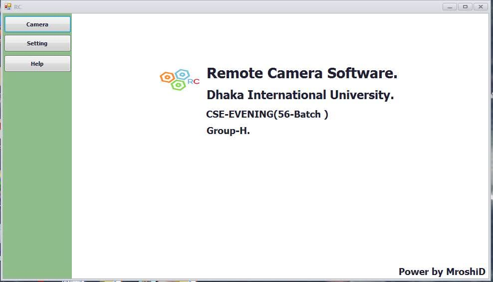

# FPV Ultrasonic Obstacle Avoiding Car with Mobile Camera Integration

## Project Overview
This project presents a smart robotic car system that integrates real-time video streaming with autonomous obstacle detection and avoidance. The car is equipped with an ultrasonic sensor to detect obstacles and navigate safely, while a mobile phone camera provides a First Person View (FPV) for live monitoring.

The video stream from the mobile device is transmitted over a local network and displayed on a custom-built desktop software, enabling users to visualize the car’s surroundings in real time. The system enhances remote navigation and monitoring capabilities through seamless hardware-software integration.

---

## Key Features
- **Real-time FPV Streaming:** Uses a mobile phone camera to transmit live video to a desktop interface.  
- **Custom Desktop Software:** Developed in-house to display live feed and allow remote monitoring.  
- **Obstacle Detection:** HC-SR04 ultrasonic sensor detects obstacles in the car’s path.  
- **Automatic Obstacle Avoidance:** Car intelligently navigates to avoid collisions.  
- **Local Network Communication:** Uses IP-based streaming for efficient data transfer between the car and monitoring software.  

---

## Technologies Used
- **Arduino** – Microcontroller for car control and sensor integration.  
- **Ultrasonic Sensor (HC-SR04)** – For obstacle detection and distance measurement.  
- **Mobile Camera** – Acts as the FPV source for live video streaming.  
- **Custom Desktop Software** – Displays live camera feed and monitors car status.  
- **Networking (IP-based)** – Facilitates live video streaming over a local network.  

---
## Custom Desktop Software Picture

## Picture 1

## System Architecture
Mobile Camera (FPV) ---> IP Network ---> Desktop Software
                          |
Arduino Controller ---> Ultrasonic Sensor ---> Car Motors

- **Video Streaming:** Mobile camera captures live video and streams it over the local network.  
- **Monitoring Software:** Receives the video feed and displays it in real time.  
- **Obstacle Detection:** Ultrasonic sensor continuously measures distance to obstacles.  
- **Autonomous Control:** Arduino processes sensor data to control the car’s movement and avoid collisions.  

---

## Setup Instructions

### Hardware Setup
1. Connect the HC-SR04 sensor to the Arduino.  
2. Connect the motor driver to Arduino and motors.  
3. Mount the mobile phone on the car as the FPV camera.  

### Arduino Code
1. Upload the Arduino sketch to control motors and read sensor data.  
2. Ensure serial communication is enabled if sending data to desktop software.  

### Desktop Software
1. Install the custom-built software on a computer.  
2. Connect to the mobile camera’s IP stream over the local network.  
3. Start monitoring the FPV feed in real time.  

### Network Configuration
- Ensure both the mobile device and computer are on the same local network.  
- Configure IP addresses in the software if needed.  

---

## Future Enhancements
- Add **manual remote control** via desktop software.  
- Integrate **AI-based object recognition** for advanced navigation.  
- Enable **cloud streaming** for remote monitoring from anywhere.  
- Add **sensor fusion** (IR, LIDAR) for improved obstacle detection.  

---

## Author
**Md. Mamunur Roshid**  
- Developed custom desktop software for FPV streaming.  
- Integrated Arduino-based obstacle avoidance with mobile camera input.  

---
